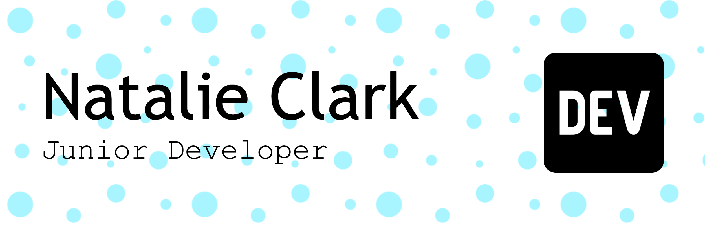

# Hi there 👋 I'm Natalie

## About Me

- I'm a medical school graduate with a passion for coding.
- I'm looking to career switch into a software development role, in which I can further my training.

## Languages I'm Learning

  
  
  
  
  

## Frameworks I'm Learning

  
  
  

## Tools I'm Learning

  
  

## Courses Completed

Aug-Oct 2022: **Code First Girls - Introduction to Python & Apps**     *(First Place)*  
Jun-Aug 2022: **Code First Girls - Intriduction to Wed Development**     *(First Place)*
